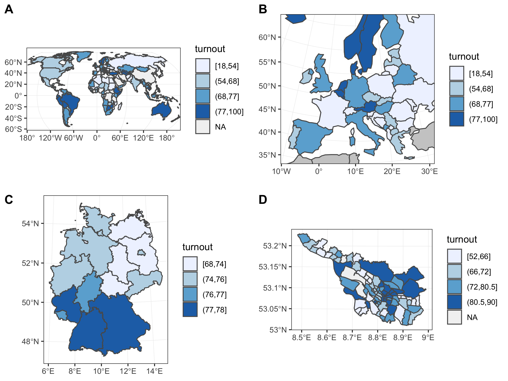

# Maps electoral turnout

__R course 2019 — Example data visualization in maps__

# Sources

* Packages (main) – tidyverse, sf, rnaturalearth

## Turnout data

* Global
   + International IDEA – Voter Turnout Database
   + https://www.idea.int/data-tools/vt-advanced-search

* Germany state level
   + Statistisches Bundesamt (Destatis)
   + Wahlberechtigte, Wähler, Wahlbeteiligung, Erststimmen, Zweitstimmen (Allgemeine Bundestagswahlstatistik): Bundesländer, Stichtag
   + https://www-genesis.destatis.de

* Bremen local level
   + Statistisches Landesamt Bremen
   + Bremen Kleinräumig Infosystem
   + Tabelle 14111-01-02: Bundestagswahl (Zweitstimmen)
   + http://www.statistik-bremen.de/soev/statwizard_step1.cfm

## Maps

* Global and German states
   + Natural Earth
   + https://www.naturalearthdata.com/

* Bremen local level
   + Statistisches Landesamt Bremen
   + http://www.statistik-bremen.de
   + shapefile format converted with sf package

# Data clean-up

* Global IDEA
   + select only relevant columns
   + remove " %"
   + variable names to lowercase and shorten
   + fix country names: Bosnia, Czechia, Macedonia, Moldova, Russia
   + export to csv

* German states
   + select only relevant columns and rows
   + export to csv

* Bremen local
   + select only relevant columns and rows
   + select only local level rows ("Ortsteil")
   + corrected Werderland -- 206 cast, 253 electorate -- turnout 81.4 (not 122.8)
   + export to csv
