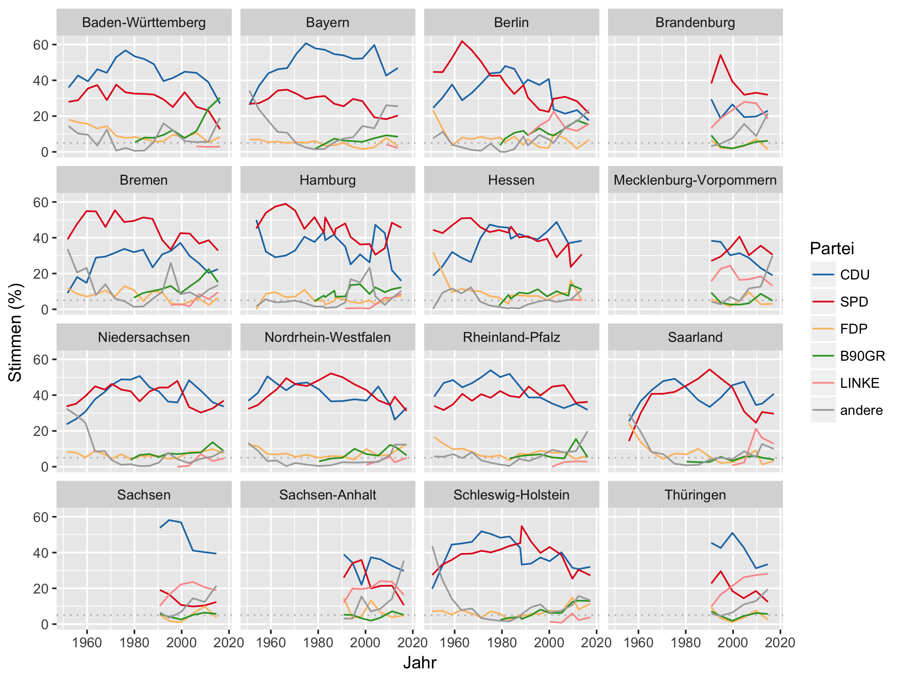

# Parteien und Wahlen in Deutschland

Arbeitsmaterialien für das Seminar "Parteien und Parteiensystem in Deutschland"
an der Universität Bremen im Sommersemester 2018

# Beispiele Grafiken

Wahlergebnisse — [wahlen-in-deutschland.de](http://www.wahlen-in-deutschland.de/)

