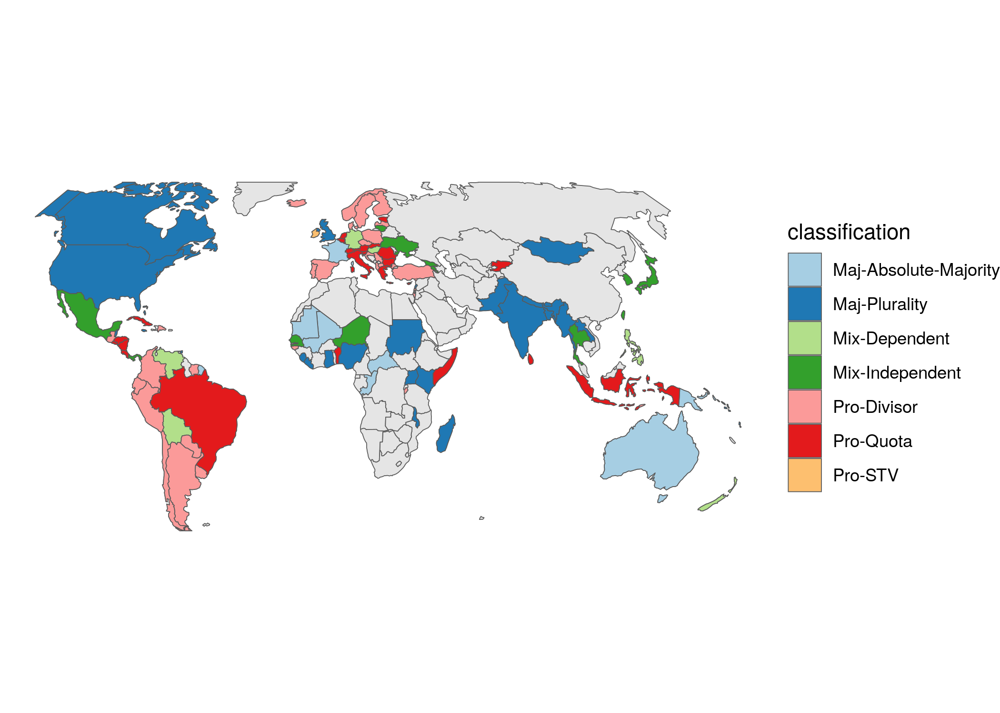
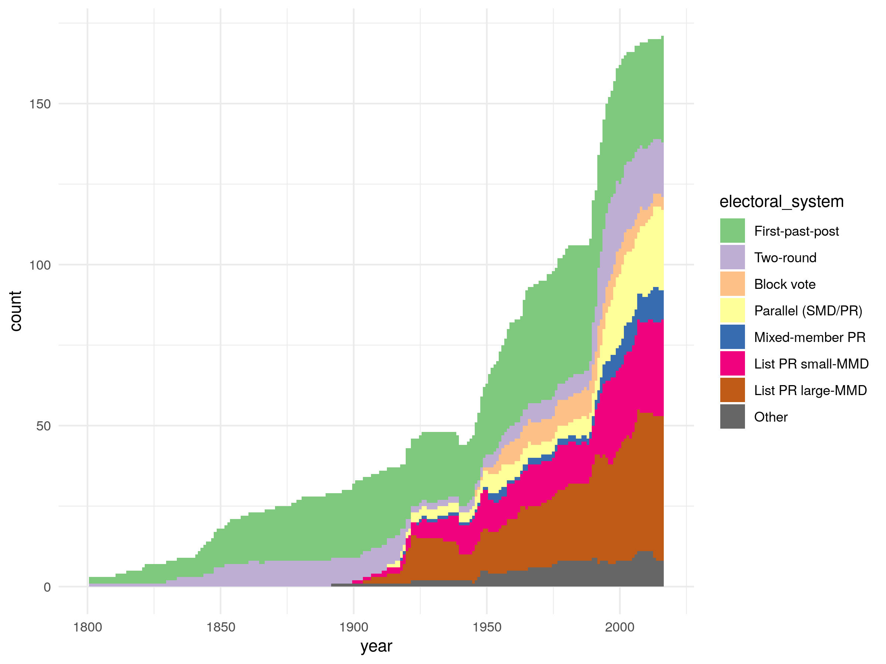
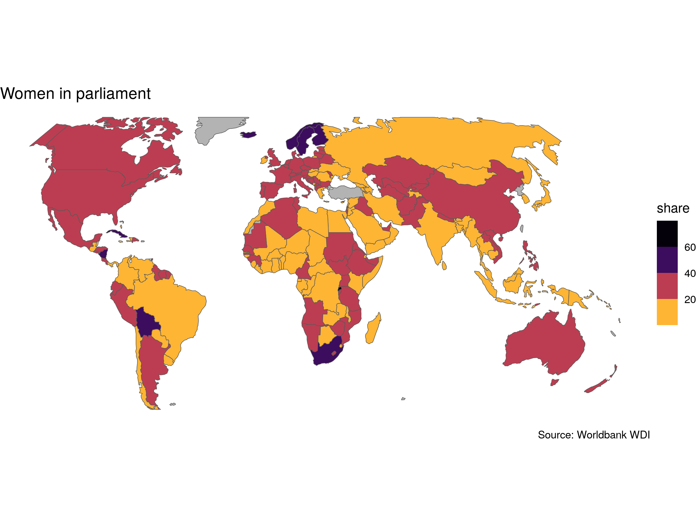
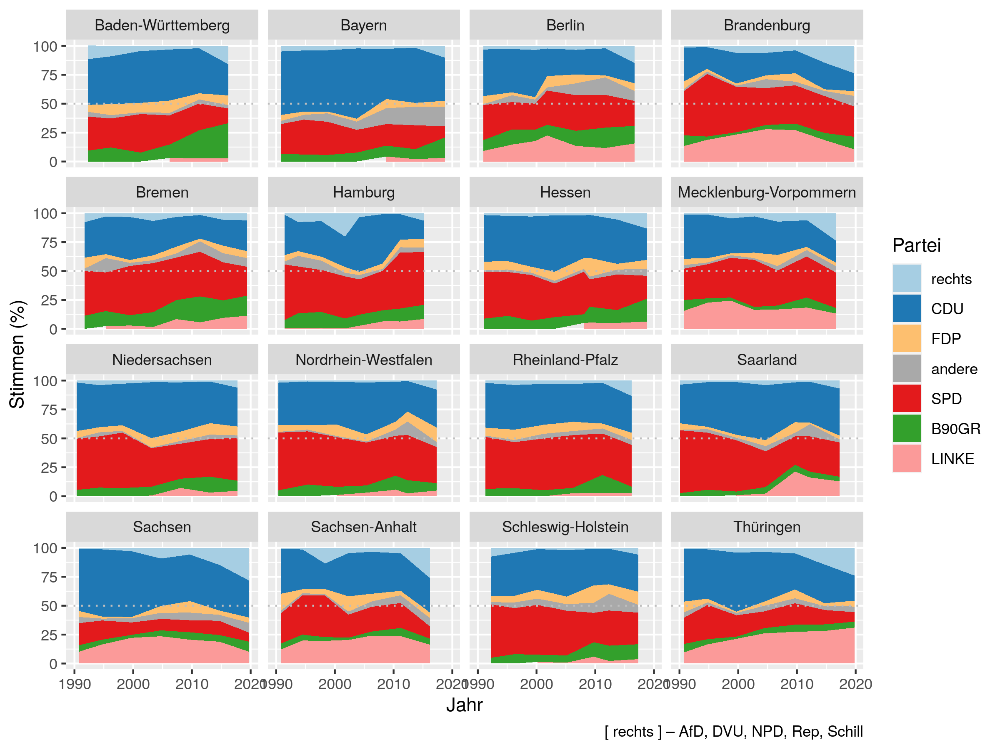
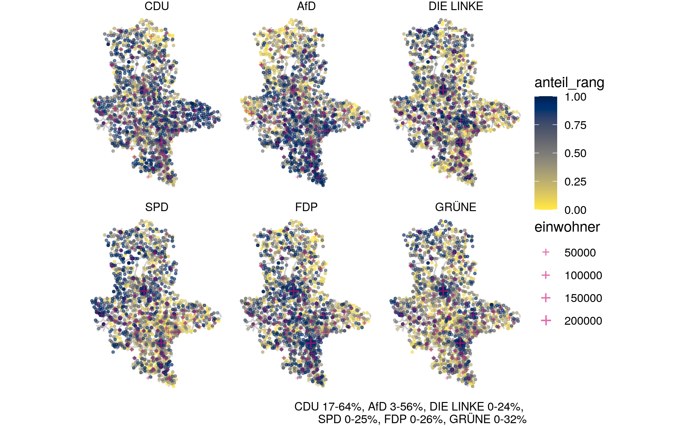
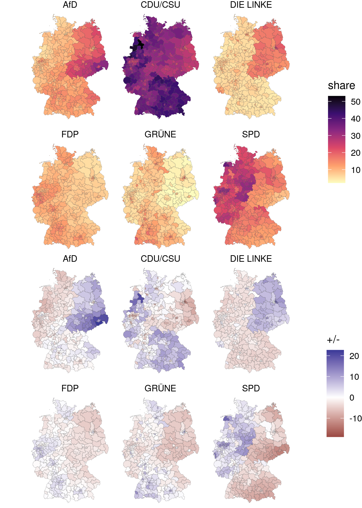

# Electoral systems

+ Wahlsysteme und politische Repräsentation
+ BA-POL-M12 – Vergleichende Systemanalyse und europäische Politik
+ Freitag 10:15 – 11:45 // Zoom // Sommersemester 2021
+ VAK 08-26-M12-4 // Universität Bremen

## Install

Use [Docker](https://docs.docker.com/get-docker/) to run RStudio in a browser with all dependencies.

<http://localhost:8787/>

```sh
docker-compose up -d  # start container in detached mode

docker-compose down   # shut down container
```

---



---



---



---



---



---


