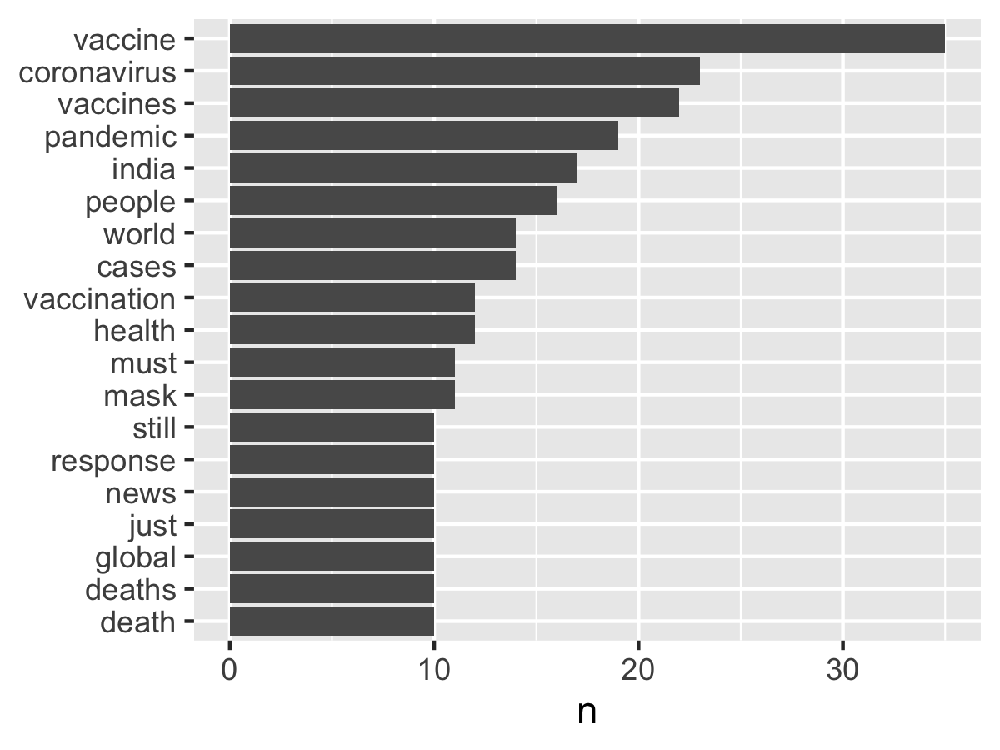

# Twitter analysis examples

+ [twitter-simple.R](twitter-simple.R) // [tidytext](https://juliasilge.github.io/tidytext/)
+ [twitter.Rmd](twitter.Rmd) // [quanteda](https://quanteda.io/)
+ [setup-authorization.R](setup-authorization.R) // [rtweet authorization](https://cran.r-project.org/web/packages/rtweet/vignettes/auth.html) (setup once)

---

